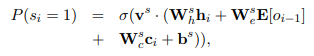
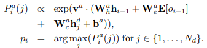
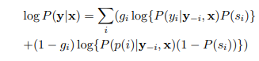

Summarization Theme 
============

1. <b>'An integrated framework of automatic document summarization and classification', 정형일. 박사졸업논문 2014 </b> 
  read 06.27 - 07.06
  - Introduces related work of document summarization using traditional methods from 2000 - 2013. 
  - Defines Relevance Feedback Method, Binary Independence Model, Cluster-based Language Model, 
    Pseudo Relevance Feedback Method. 
  - Above are only the part of the dissertation.

2. <b>'A Neural Attention Model for Sentence Summarization', Rush et al. EMNLP, 2015. </b> 
  read 06.27 - 07.03
  - Introduces method of abstractive sentence summarization using Neural Network.
  - It sets language model as a foundation of the subject to be trained. 
  - Based on the Language model from Bengio et al. 2013 (NNLM), it incorporates a encoder 
    which conveys information of the input text and decoding context into the language model. 
  - Encoder has three options to be chosen.
  	i) Bow
  	ii) Convolutional
  	iii) Attention

3. <b>'Abstractive Sentence Summarization with Attentive Recurrent Neural Networks', Chopra et al. NAACL-HLT 2016.</b> 
  read 07.02
  - RNN version of Rush et al. 2015. 

4. <b>'Abstractive Text Summarization using Sequence-to-sequence RNNs and Beyond', Nallapati et al. SIGNLL conference on Computational Natural Language Learning, 2016. </b> 
  read 07.05 - 07.09
  - baseline model corresponds to the NMT model used in Bahdanau et al. 2014.
  	i) Encoder : bidirectional GRU-RNN
  	ii) Decoder : uni-directional GRU-RNN
  	iii) Attention over the source-hidden states and a soft-max layer over target vocab.
  - LVT (Large Vocabulary Trick) : The decoder-vocab of each mini-batch is restricted to words in the source documents of that batch.
    + Most frequent words in the target dict. are added until the vocab reaches a fixed size. 
  	=> reduce the size of the soft-max layer, speeds up convergence by focusing the modeling effort only on the words that are essential to a given example.
  - Feature-rich Encoder : concatenate TF, IDF, NER, POS features to the word-based embeddings as the representation. 
  - Switch between Generator-Pointer : 
  	

  			
  	

  	
  	

  			
  	

  	
  	

  			
  	

  - Hierarchical Document structure with Hierarchical Attention 

5. <b>'Neural Summarization by Extracting Sentences and Words', Cheng et al. ACL 2016. </b> 
  read 07.06 - 07.10
  - task of a document summarization into a single sentence.
  - trained on DailyMail news.
  	+ for sentence extraction train data : label 1/0 for sentences that are included/not-included respectively.
  	+ for word extraction train data : 
  		* If every high-lighted words from the document, include them. 
  		* If OOV, find a sementically equivalent replacement present in the news article. 
  		* otherwise, discard the document-highlights pair.
  - Model
  	+ comprised of Document Reader 
  		* Convolutional Sentence Encoder to encode each sentence of document, 
  		* then use each one of'em as input for the RNN representing a document. 
  	+ Sentence Extractor 
  		* labeler to predict if the sentence is included in the summary. 
  	+ Word Extractor
  		* Generating words that are part of the summary 

6. **'Get To The Point : Summarization with Pointer-Generator Netoworks' **
  read 07.14.
  - task of a text summarization into summarized sentences.

  - trained on CNN/DailyMail news.

  - used Attention model as a baseline, a similar model to 'Nallapati et al. (2016)'

  - added a pointer-generator network

  - Coverage mechanism derived from Tu et al. 2016

    

7. **'Retrieve, Rerank and Rewrite : Soft Template Based Neural Summarization', Cao et al. 2018, ACL.**

   read 08.11

   * summarization using combination of seq2seq and template based summarization approaches.
   * templates are extracted using IR system Lucene. (given sentence input, outputs a template sentence)
     * using that template sentence, outputs corresponding consitituents with seq2seq. 
   * offers URL links to the CNN/DailyMail dataset, Gigaword dataset.
